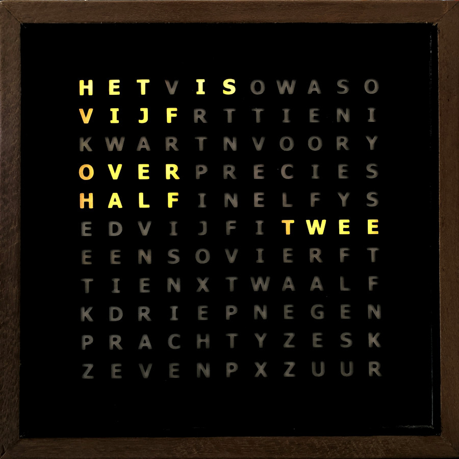
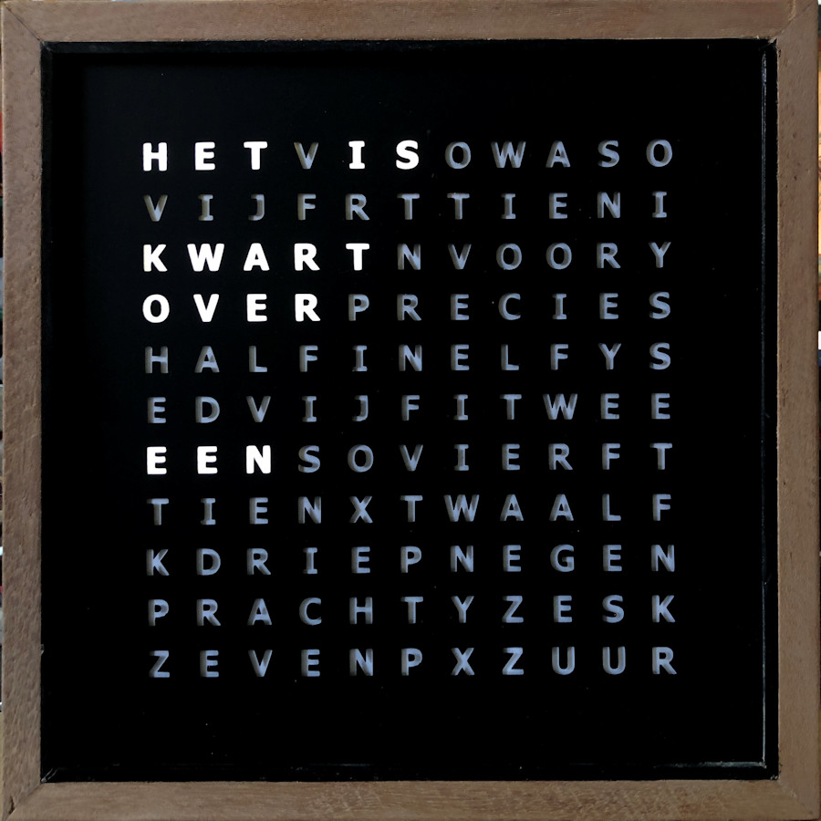

# WordClock23cm
Software for 23cm clock with RGB(W) LEDs behind the used words 

  

 
De bouw van de klokkast en spacerplaat lijkt op deze klok https://ednieuw.home.xs4all.nl/Woordklok/Bouwpakket/WoordklokWitteLEDs.html
maar de witte LEDs zijn dan de SK6812 LEDstrips 
De LEDs worden geschakelt als in deze klok https://ednieuw.home.xs4all.nl/Woordklok/Bouwpakket/WoordklokSK6812.htm 
De LEdstrip begint bij de H van HET en eindigt bij de R van UUR Data Out van HET wordt doorgeschakel aan Data IN van IS enzovoort 

Rest van de bechrijving volgt
